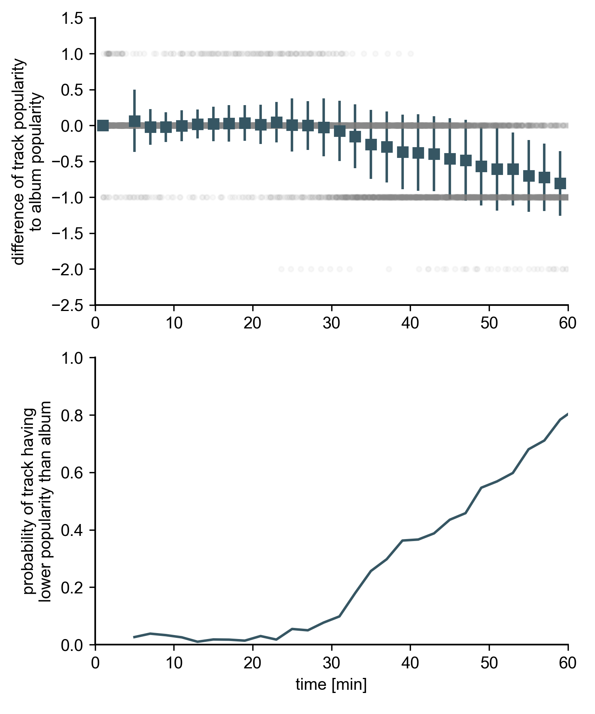

# Drei ??? Sleeping Beauty Hypothesis

## Introduction

[Die Drei ???](https://de.wikipedia.org/wiki/Die_drei_%3F%3F%3F) (or [The Three Investivators](https://en.wikipedia.org/wiki/Three_Investigators) originally) is an audio play series that enjoys great popularity in Germany. Anecdotal evidence suggests that many people listen to episodes of the series to facilitate falling asleep. We test this hypothesis, which we dub the "Drei ??? Sleeping Beauty Hypothesis", by measuring temporal track popularity per episode (i.e. album) on Spotify.

## Prerequisites

This repo uses [spotipy](https://github.com/plamere/spotipy) to collect data.
Create a Spotify developer account and an App so you can obtain a "Client ID" and a "Client Secret".
Save both in a json file in `~/.spotipy/identity.json` like this:

```json
{
    "client_id": "9bafa...",
    "client_secret": "640da..."
}
```

Also, install the requirements:

    pip install -r requirements.txt

## Methods

For each regular (i.e. numbered) episode of the series, we collected all tracks on the album, their duration, and their "popularity" as computed by Spotify based on number of plays and a few other observables. Popularity can reach values between 0 (not popular) and 100 (very popular). Data was collected on July 27, 2021 by running

    python3.8 load_albums.py
    python3.8 load_tracks.py
    python3.8 load_track_popularity.py

We associate tracks with a timestamp that's equal to the cumulative time that has passed on the episode when the track has finished playing. We define "album popularity" as the most common track popularity score of the first 12 tracks on the album. Finally, we measure the difference of a track's popularity and the album popularity and plot this difference against the track's timestamp. We furthermore bin track popularities to time bins of size `dt = 2min` to compute time series of average track propularity. Note that the second bin is omitted in the analysis since newer episodes tend to have an "Inhaltsangabe" (episode summary) as the second album track. Those tracks seem to have an abnormally low popularity, indicating that most listeners skip them. We therefore omit those tracks when analyzing averages and probabilittes.

The analysis was performed by running

    python3.8 plot.py

## Results

The average track popularity remains roughly constant over time for the first 30 minutes of an episode, then begins to drop. Furthermore, the probability of a track to have popularity lower than album popularity begins to grow after 30 minutes, increasing almost monotonically. See figure below.


Figure 1. Track popularity over time. Grey dots represent single track popularities of all tracks of regular episodes of the series. Blue squares show mean and standard deviation of track popularity over time.

## Discussion and Conclusion

Based on the results presented above and the fact that Spotify's sleep timer option begins with 15min and 30min we argue that a non-vanishing amount of people use the episodes of the series to fall asleep. The sleep timer option offers users of the app the possibility to automatically stop playing the album after X minutes, where X is predefined.

In order to draw more rigorous conclusions, we would have to compare the time series above to other albums, possibly music albums or audio books. An analysis of the actual number of plays per track would further allow us to judge the number/ratio of people who actually do use the series to fall asleep. Unfortunately, these numbers are only available on the app, not through the API, mitigating a simple analysis.
